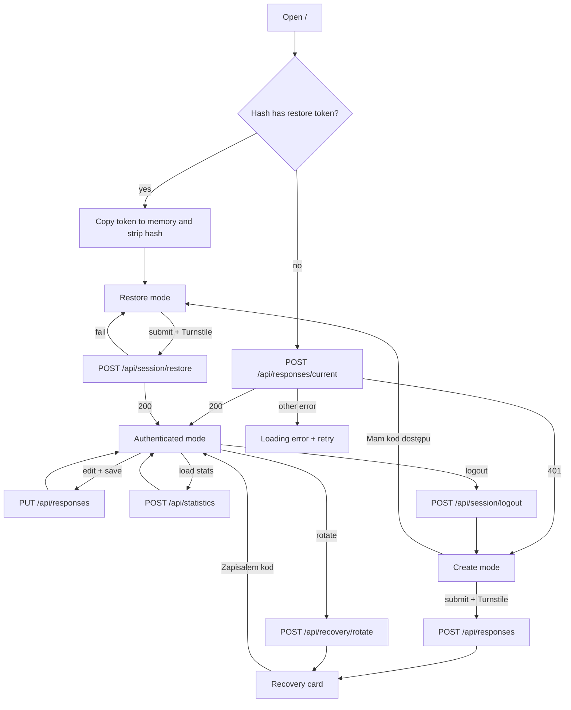
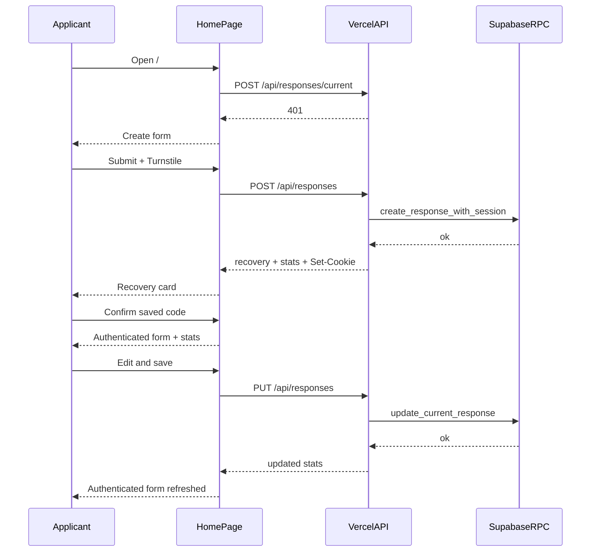
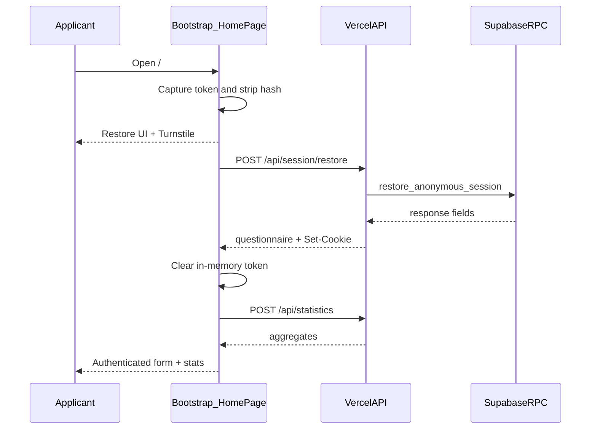

# NAWA Tracker End-to-End Flow Design

## Status

This document is the single end-to-end view of how NAWA Tracker works for applicants: from first visit through create, recover, update, compare, rotate, and logout.

It describes the **current product** as implemented. Detailed identity rules live in `2026-07-13-anonymous-recovery-session-design.md`. Questionnaire, statistics, and privacy rules live in `2026-07-13-anonymous-scholarship-tracker-design.md`. When those focused specs conflict with older historical notes inside them, the focused recovery design wins for identity; this document wins as the narrative of the full user journey.

Admin tooling, accounts, OAuth, and admissions prediction are **out of scope**.

## Goal

An applicant can:

1. Fill an anonymous scholarship questionnaire.
2. Save a one-time recovery code / QR.
3. Keep editing on the same browser via an HttpOnly session cookie.
4. Restore access on another device with the recovery code.
5. See privacy-safe aggregate statistics about similar applications.
6. Rotate the recovery code or log out of the current device.

No registration. No email. No prediction of admission chances.

## Actors And Credentials

| Actor / secret | What it is | Where it lives |
|----------------|------------|----------------|
| Applicant | Person filling the form | Browser only |
| Recovery token | Long-lived bearer secret to restore access | Shown once in UI memory; DB stores HMAC hash only |
| Session token | Short/medium-lived bearer for ordinary API calls | HttpOnly cookie; DB stores HMAC hash only |
| Turnstile token | Bot proof | Required on create and restore |

There is no user account table. One response row owns one recovery hash and zero or more sessions.

## System Map

```text
Browser SPA (/)
  ├─ take #restore=… fragment at bootstrap, then strip it
  ├─ HomePage mode machine
  │    loading | create | restore | recovery | authenticated
  └─ same-origin fetch /api/* with credentials

Vercel API
  ├─ POST /api/responses              create + cookie + recovery once
  ├─ PUT  /api/responses              update owned response
  ├─ POST /api/responses/current      load owned response
  ├─ POST /api/statistics             privacy-safe aggregates
  ├─ POST /api/session/restore        recovery → new session cookie
  ├─ POST /api/session/logout         revoke this session
  └─ POST /api/recovery/rotate        new recovery credential once

Supabase PostgreSQL (service_role only)
  ├─ responses
  ├─ anonymous_sessions
  ├─ submission_limits
  └─ private RPCs for atomic create / restore / update / stats / rotate / revoke
```

## UI Modes

Single page. Mode is React state in `HomePage`, not URL routing (except the one-time `#restore=` fragment consumed at bootstrap).

| Mode | User sees | How they got here |
|------|-----------|-------------------|
| `loading` | Loading / logout / retry | Startup session probe, or logout in progress |
| `create` | Empty questionnaire + Turnstile; link “I have an access code” | No session, or after logout |
| `restore` | Manual recovery entry + Turnstile (token may be prefilled from fragment) | `#restore=` visit, or “I have an access code” |
| `recovery` | One-time code, URL, QR, confirm button | After successful create or rotate |
| `authenticated` | Editable form, stats, rotate, logout | Valid session after create confirm, restore, or startup |

## Master Flow



---

## Flow 1 — First Visit, No Session

**Trigger:** applicant opens `/` with no `#restore=` fragment and no valid session cookie.

### Steps

1. Bootstrap runs `takeRecoveryTokenFromFragment()` → `null`.
2. `HomePage` starts in `loading` (`reason: startup`).
3. Client calls `POST /api/responses/current` with empty body and `credentials: "same-origin"`.
4. API reads session cookie → missing/invalid → `401`.
5. UI switches to `create`.
6. Applicant fills questionnaire (track, route, type, country, grade, university, field, priority, status, optional decision date).
7. Client completes Turnstile and calls `POST /api/responses` with `{ response, turnstileToken }`.

### Server create pipeline

1. Assert same origin.
2. Validate body with Zod.
3. Verify Turnstile.
4. Hash IP; enforce create rate limit (3 / 24h per IP hash).
5. Normalize questionnaire; recompute `grade_percentage` server-side.
6. Mint recovery token + session token; store only HMAC hashes.
7. Atomically insert `responses` row, first `anonymous_sessions` row, and create `submission_limits` event.
8. Set HttpOnly session cookie.
9. Return `{ created: true, recoveryToken, recoveryUrl, statistics }` once.

### UI after create

1. Mode → `recovery` with credential in React memory only.
2. Show QR (`APP_PUBLIC_URL/#restore=<token>`), copyable code, warning, confirm CTA.
3. On confirm → mode `authenticated`; recovery material cleared from state and cannot be shown again without rotate.
4. Statistics panel shows result from create response (or reloads if still loading).

### Failure paths

| Failure | User effect |
|---------|-------------|
| Turnstile missing/invalid | Form error; stay in create |
| Validation / grade errors | `400`; stay in create |
| Rate limited | `429`; stay in create |
| Origin mismatch | `403` |
| Server/DB failure | No partial response/session/cookie; generic error |

---

## Flow 2 — Return Visit, Same Browser

**Trigger:** applicant returns later with a still-valid session cookie.

### Steps

1. Bootstrap: no restore fragment.
2. `POST /api/responses/current` → `200` + questionnaire fields only.
3. Mode → `authenticated` with form seeded from server.
4. Client calls `POST /api/statistics` in parallel/follow-up.
5. Stats panel shows available aggregates or suppressed empty state.

### Session resolution (every authenticated call)

1. Read cookie `SESSION_COOKIE_NAME`.
2. Validate canonical base64url token shape.
3. HMAC with `SESSION_HMAC_SECRET`.
4. RPC resolves `response_id` where session is not revoked and not expired.
5. All reads/writes are scoped to that `response_id`.
6. Internal IDs and hashes never return to the browser.

### Cookie attributes

```text
HttpOnly
SameSite=Lax
Path=/
Max-Age = SESSION_MAX_AGE_DAYS * 86400   # default 180 days
Secure in production
```

---

## Flow 3 — Update Questionnaire

**Trigger:** authenticated applicant edits fields and saves.

### Steps

1. Form stays in update mode; drafts tracked in page state.
2. Submit → `PUT /api/responses` with `{ response }` only (no Turnstile, no IDs, no tokens in body).
3. Server: origin check → session resolve → validate/normalize → update row.
4. Suspicious rule: flipping final decision `positive_decision` ↔ `negative_decision` sets sticky `is_suspicious = true`.
5. Response includes refreshed `statistics`.
6. UI keeps `authenticated`, updates seed/draft/stats.

### Failure paths

| Failure | User effect |
|---------|-------------|
| Session gone | Error surfaced by form/API client; may need restore |
| Validation | Stay authenticated with field errors |
| Network/5xx | Previous seed restored into pending handling; optional stats reload |

---

## Flow 4 — Restore On Another Device (QR / Link)

**Trigger:** applicant opens `https://app…/#restore=<token>` on a new browser.

### Steps

1. Bootstrap copies canonical token into memory.
2. Immediately strips the hash via `history.replaceState` **before** React work / analytics.
3. `HomePage` mounts directly in `restore` with `initialRecoveryToken`.
4. Restore UI auto-runs Turnstile when a token is present (or user submits manually).
5. `POST /api/session/restore` with `{ recoveryToken, turnstileToken }`.
6. On success: new session cookie set; body returns questionnaire only; in-memory recovery token cleared.
7. Mode → `authenticated`; then `POST /api/statistics`.

### Server restore pipeline

1. Assert same origin.
2. Validate body; verify Turnstile.
3. Hash IP; enforce restore rate limit (10 / 15m per IP hash).
4. Hash recovery token; look up response without leaking existence.
5. Mint new session; insert session + rate-limit attempt atomically.
6. Set cookie; return owned questionnaire fields.

Failed lookups and invalid tokens share one generic Polish error. Rate-limit attempts are recorded even for unknown tokens.

### Failure / cancel

- Failed restore: stay on restore UI; may reconcile existing session if one already exists on this browser.
- Cancel: reconcile toward create (or authenticated if a cookie already works).

---

## Flow 5 — Manual Restore (“Mam kod dostępu”)

**Trigger:** applicant is on create screen without a fragment and chooses restore.

### Steps

1. Mode → `restore` with `recoveryToken: null`.
2. User pastes code; completes Turnstile; submits.
3. Same API path as Flow 4.
4. Input remains in component memory only; cleared after attempt.

No `localStorage` / `sessionStorage` for credentials at any point.

---

## Flow 6 — Rotate Recovery Code

**Trigger:** authenticated applicant chooses “generate new access code”.

### Steps

1. `POST /api/recovery/rotate` (session cookie + origin).
2. Server replaces `recovery_token_hash`, sets `recovery_token_rotated_at`.
3. Returns new `{ recoveryToken, recoveryUrl }` once.
4. UI → `recovery` with rotation warning: previous QR/code is dead.
5. Existing sessions on all devices remain valid.
6. Confirm → back to `authenticated`.

---

## Flow 7 — Logout (This Device)

**Trigger:** authenticated applicant logs out.

### Steps

1. Mode briefly `loading` (`reason: logout`).
2. `POST /api/session/logout`.
3. Server revokes **this** session when resolvable; always clears cookie (idempotent).
4. Questionnaire row and other device sessions unchanged.
5. Mode → `create`.

---

## Flow 8 — Statistics Lifecycle

Statistics are never a public anonymous browse of all data. They always require a session-scoped response as the comparison anchor.

### When fetched

| Moment | Source |
|--------|--------|
| After create | Embedded in create API result |
| After update | Embedded in update API result |
| After restore / startup auth / recovery confirm (if needed) | `POST /api/statistics` |

### Privacy rules (applicant-visible)

1. Exclude rows with `is_suspicious = true`.
2. Choose the tightest comparison group that still has `n >= 10`:
   - track + route + type + university + field
   - else track + route + type + university
   - else track + route + type
3. If even the widest group has `n < 10`, return `detailsAvailable: false` and hide detailed metrics.
4. When available, show median grade %, share below applicant grade, and decision counts (waiting / positive / negative) for the chosen group, plus broader counts as defined by the stats contract.

Applicant never receives other people’s raw rows, response UUIDs, or token material.

---

## Data Written Per Happy Path

### Create

| Store | Written |
|-------|---------|
| `responses` | Questionnaire + `recovery_token_hash` |
| `anonymous_sessions` | First `session_token_hash`, `expires_at` |
| `submission_limits` | `ip_hash`, `limit_type='create'`, optional fingerprint |
| Browser cookie | Raw session token |
| Browser memory (brief) | Raw recovery token until confirm |

### Restore

| Store | Written |
|-------|---------|
| `anonymous_sessions` | New session for existing response |
| `submission_limits` | `limit_type='restore'` attempt |
| Browser cookie | New raw session token |

### Update

| Store | Written |
|-------|---------|
| `responses` | Field updates; maybe `is_suspicious`; `updated_at` |

### Rotate

| Store | Written |
|-------|---------|
| `responses` | New `recovery_token_hash`, `recovery_token_rotated_at` |
| Browser memory (brief) | New raw recovery token until confirm |

### Logout

| Store | Written |
|-------|---------|
| `anonymous_sessions` | `revoked_at` for current session |
| Browser cookie | Cleared |

Never persisted: raw recovery tokens, raw session tokens, raw IPs, names, emails, phone numbers.

---

## Cross-Cutting Rules

### Same-origin

Mutating applicant endpoints require `Origin` matching `APP_PUBLIC_URL`. No permissive CORS. Client always uses same-origin URLs + `credentials: "same-origin"`.

### Validation

Shared Zod schemas in `shared/` for browser and API. Grades recomputed on the server; client percentage is not trusted.

### i18n

Applicant UI: PL / EN / RU. Product copy is Polish-first; API auth/recovery failure messages follow the recovery design (stable codes + localized client mapping where applicable).

### Security headers

CSP and related headers from `vercel.json` apply to the SPA. Turnstile is the only intentional third-party script/frame origin for the applicant flow.

### Logging

No request bodies, cookies, tokens, token hashes, or raw IPs in logs.

---

## Sequence: Create → Confirm → Update



## Sequence: QR Restore On New Device



---

## Out Of Scope

- Admin dashboard / operator tooling
- User registration, email, social login
- Multi-device session management UI
- Predictive admission models
- Official NAWA integration
- Public browse of all responses without a session

## Acceptance Checklist (E2E)

1. Cold visit without cookie lands on create.
2. Successful create sets cookie, shows recovery once, then authenticated after confirm.
3. Reload with cookie restores authenticated form without recovery card.
4. `#restore=` strips hash immediately and restores into authenticated mode on success.
5. Manual restore works from create screen.
6. Update persists fields and refreshes stats; decision flip can mark suspicious.
7. Rotate invalidates old code, shows new card once, keeps sessions.
8. Logout clears this device only and returns to create.
9. Stats hide details when `n < 10` and exclude suspicious rows.
10. No credentials in `localStorage` / `sessionStorage`; no Supabase keys in the browser bundle.
