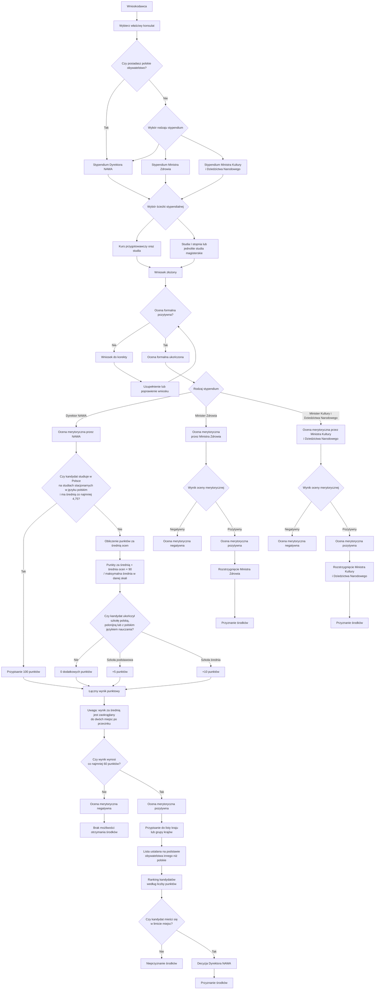

```mermaid
flowchart TD
    A[Wnioskodawca] --> B[Wybierz właściwy konsulat]
    B --> C{Czy posiadasz polskie obywatelstwo?}

    C -->|Tak| D[Stypendium Dyrektora NAWA]

    C -->|Nie| E{Wybór rodzaju stypendium}
    E --> D
    E --> E2[Stypendium Ministra Zdrowia]
    E --> E3[Stypendium Ministra Kultury<br/>i Dziedzictwa Narodowego]

    D --> F{Wybór ścieżki stypendialnej}
    E2 --> F
    E3 --> F

    F --> F1[Kurs przygotowawczy oraz studia]
    F --> F2[Studia I stopnia lub<br/>jednolite studia magisterskie]

    F1 --> G[Wniosek złożony]
    F2 --> G

    G --> H{Ocena formalna pozytywna?}

    H -->|Nie| I[Wniosek do korekty]
    I --> J[Uzupełnienie lub poprawienie wniosku]
    J --> H

    H -->|Tak| K[Ocena formalna ukończona]
    K --> L{Rodzaj stypendium}

    %% Stypendium Dyrektora NAWA

    L -->|Dyrektor NAWA| M[Ocena merytoryczna przez NAWA]
    M --> N{Czy kandydat studiuje w Polsce<br/>na studiach stacjonarnych w języku polskim<br/>i ma średnią co najmniej 4,75?}

    N -->|Tak| N1[Przypisanie 100 punktów]

    N -->|Nie| O[Obliczenie punktów za średnią ocen]
    O --> O1["Punkty za średnią = średnia ocen × 90<br/>/ maksymalna średnia w danej skali"]

    O1 --> P{Czy kandydat ukończył szkołę polską,<br/>polonijną lub z polskim językiem nauczania?}

    P -->|Nie| P1[0 dodatkowych punktów]
    P -->|Szkoła podstawowa| P2[+5 punktów]
    P -->|Szkoła średnia| P3[+10 punktów]

    P1 --> Q[Łączny wynik punktowy]
    P2 --> Q
    P3 --> Q
    N1 --> Q

    Q --> Q0["Uwaga: wynik za średnią jest zaokrąglany<br/>do dwóch miejsc po przecinku"]

    Q0 --> R{Czy wynik wynosi<br/>co najmniej 60 punktów?}

    R -->|Nie| S[Ocena merytoryczna negatywna]
    S --> S1[Brak możliwości otrzymania środków]

    R -->|Tak| T[Ocena merytoryczna pozytywna]
    T --> U[Przypisanie do listy kraju<br/>lub grupy krajów]

    U --> U1[Lista ustalana na podstawie<br/>obywatelstwa innego niż polskie]
    U1 --> U2[Ranking kandydatów<br/>według liczby punktów]
    U2 --> U3{Czy kandydat mieści się<br/>w limicie miejsc?}

    U3 -->|Nie| U4[Nieprzyznanie środków]
    U3 -->|Tak| U5[Decyzja Dyrektora NAWA]
    U5 --> U6[Przyznanie środków]

    %% Stypendium Ministra Zdrowia

    L -->|Minister Zdrowia| V[Ocena merytoryczna<br/>przez Ministra Zdrowia]
    V --> V1{Wynik oceny merytorycznej}

    V1 -->|Negatywny| V2[Ocena merytoryczna negatywna]
    V1 -->|Pozytywny| V3[Ocena merytoryczna pozytywna]
    V3 --> V4[Rozstrzygnięcie Ministra Zdrowia]
    V4 --> V5[Przyznanie środków]

    %% Stypendium Ministra Kultury

    L -->|Minister Kultury i Dziedzictwa Narodowego| W[Ocena merytoryczna przez Ministra Kultury<br/>i Dziedzictwa Narodowego]
    W --> W1{Wynik oceny merytorycznej}

    W1 -->|Negatywny| W2[Ocena merytoryczna negatywna]
    W1 -->|Pozytywny| W3[Ocena merytoryczna pozytywna]
    W3 --> W4[Rozstrzygnięcie Ministra Kultury<br/>i Dziedzictwa Narodowego]
    W4 --> W5[Przyznanie środków]
```
